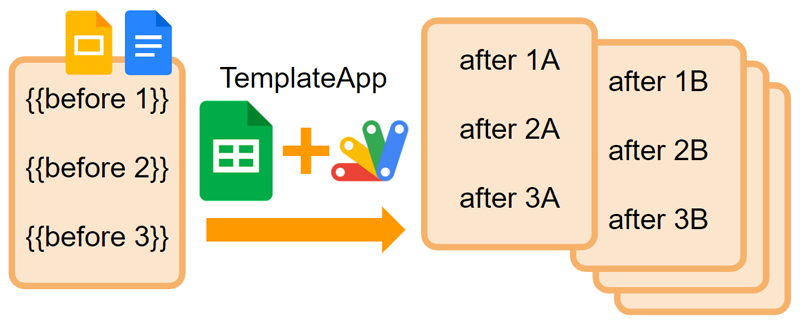
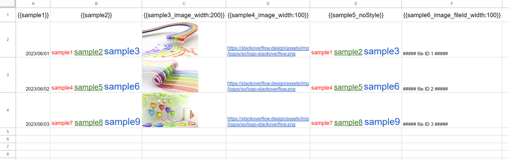
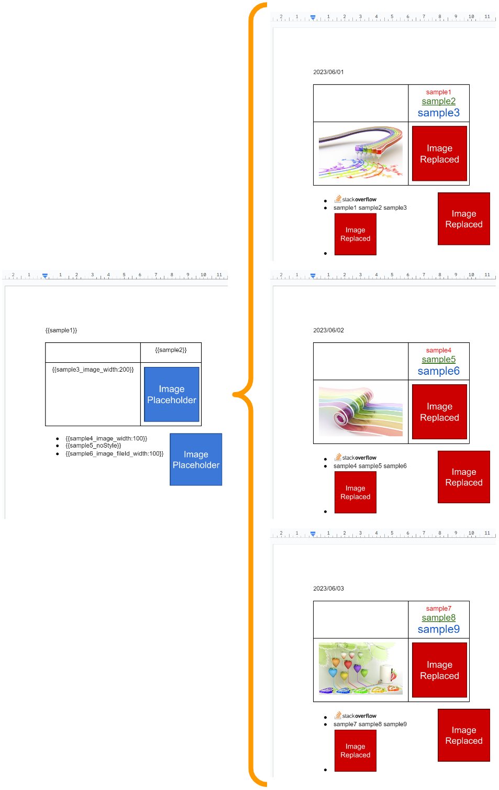
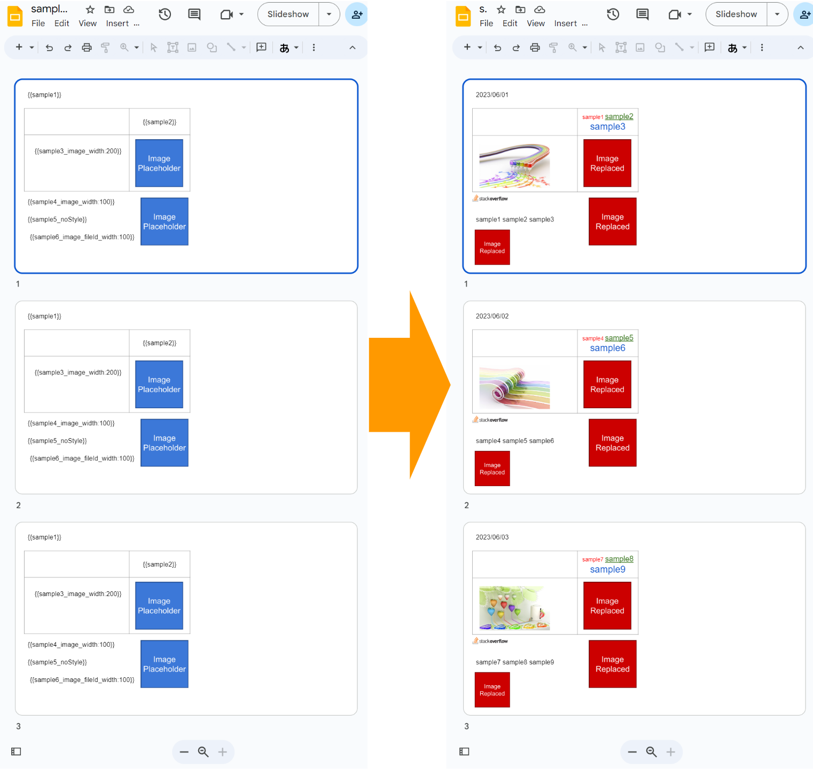

# TemplateApp

<a name="top"></a>
[MIT License](LICENCE)



<a name="overview"></a>

# Overview

This is a Google Apps Script library for easily managing the template of Google Documents and Google Slides using Google Spreadsheet as a database using Google Apps Script.

<a name="description"></a>

# Description

You might have situations where are required to create multiple Google Documents and Google Slides from the templates using Google Spreadsheet as a database with Google Apps Script. When the simple texts are replaced with the placeholders on the templates, this can be achieved by a simple script. However, there is the case that the images are required to be inserted into the templates. In this case, the script is complicated. The method for replacing the placeholders with the images is different between Google Documents and Google Slides. And, when I see questions on Stackoverflow, a lot of questions related to the template process using Google Documents and Google Slides can be seen. Furthermore, I personally have a lot of questions related to this from other users. From this situation, I thought that when managing the template process can be simply run, it will be useful for a lot of users. So, I created this library.

There are 2 useful features in this library.

1. Text styles in the cells on the Spreadsheet can be reflected in the template.
2. Images in the cells can be used.

In my experience, when the text styles of the cells were reflected in the template and the images in the cells can be used, it was useful. However, unfortunately, I have never seen them. So, I thought that if those are implemented, it might be useful for other users.

<a name="limitations"></a>

# Limitations

Before you use this library, please confirm the following limitations.

- This library uses the values of the header row of the Spreadsheet as the values of placeholders in Google Documents and Google Slides. So, please match each value.
- The values of placeholders have specific values for controlling the replaced values. So, please read the sample scripts.
- This library doesn't use the merged cells in Google Spreadsheet.
- In the case of Google Slide, it supposes that one placeholder is included in one shape. When the placeholder is included in the paragraph, this cannot be used correctly.

- The default colors of linked text can be given by `linkForGroundColorForDoc` and `linkForGroundColorForSlide` for Google Document and Google Slide, respectively.
- When you use `excludeTextStyles`, please set `useStyleOfSpreadsheet` as `true`.
- In the case of Google Documents, when you use images as the placeholder of Google Document, please be the same image size both before and after the replacement. And also, it is required to enable Google Docs API. Because when Document service (DocumentApp) is used, the positioned images cannot be correctly replaced because the margin of images cannot be controlled by the script.
- In the case of Google Documents, when you use images as the placeholder of Google Document, please set the text placeholder to the title of the image. This library replaces the images using the titles of the images.
- In the case of Google Slides, please don't group the shapes and the images. This library skips the groups.
- In the case of Google Slides, when you want to replace the texts in the cells of a table as placeholders, please put the shape including the text to the cell. Please don't directly put the text. Because when the text is directly set to the cell, the correct position of the cell text cannot be retrieved.
- When a lot of rows are existing in the Spreadsheet, the process might not be able to be done in one run. At that time, please separate the rows.

# Library's project key

```
1DbOiAxK9Kwndl-5848xLP91xhUzTidfXkBOxBpWG2uw8fxdvf0Vt3sk4
```

<a name="usage"></a>

# Usage

## 1. Install library

In order to use this library, please install the library as follows.

1. Create a GAS project.

   - You can use this library for the GAS project of both the standalone type and the container-bound script type.

1. [Install this library](https://developers.google.com/apps-script/guides/libraries).

   - Library's project key is **`1DbOiAxK9Kwndl-5848xLP91xhUzTidfXkBOxBpWG2uw8fxdvf0Vt3sk4`**.

# Scopes

This library uses the following 2 scopes.

- `https://www.googleapis.com/auth/drive.readonly`
- `https://www.googleapis.com/auth/script.external_request`

But, on your client side, the scopes of `https://www.googleapis.com/auth/documents`, `	https://www.googleapis.com/auth/presentations`, and `https://www.googleapis.com/auth/drive` might be required to be used.

# Placeholder

In this library, the control code is included in the text which is used as the placeholder. And, please use the text of the placeholder like `{{sample}}`. In the current stage, the control code is as follows.

| Control code   | Description                                                                                                                                                                                                            |
| :------------- | :--------------------------------------------------------------------------------------------------------------------------------------------------------------------------------------------------------------------- |
| `image`        | When `image` is used to the placeholder like `{{sample_image}}`, the placeholder is replaced with an image. Please separate the text of placeholder and the control code by the underscore `_`.                        |
| `width:number` | `width:number` is used to `image`. When `width:number` is used to the placeholder like `{{sample_image_width:200}}`, the placeholder is replaced with an image. And, the image size is set to 200 pixels in the width. |
| `fileId`       | `fileId` is used to `image`. When `fileId` is used to the placeholder like `{{sample_image_fileId_width:200}}`, the value of Spreadsheet is used as the file ID of the image file.                                     |
| `noStyle`      | When `noStyle` is used, the text of the placeholder is replaced with the value of Spreadsheet without reflecting the rich text.                                                                                        |

# IMPORTANT: Sample Spreadsheet

In this library, a Spreadsheet is used as a database for replacing the placeholders in Google Documents and Google Slides. So, first, please create a new Spreadsheet and put the values to the Spreadsheet.

Before it introduces the sample scripts for each method, it introduces the sample Spreadsheet as a database. In this library, in order to replace the placeholders with the texts and images, the control code is used in the text which is used as the placeholder. So, please confirm this section before you use this library.

The sample Spreadsheet is shown in the following image.



Each value in the header row of the 1st row is the placeholder. When the placeholders of the above sample Spreadsheet are used, those explanations are as follows.

| Placeholder                          | Description                                                                                                                                                                                                                                                                                                                                                                                                                                                                                                                                                                                                                                  |
| :----------------------------------- | :------------------------------------------------------------------------------------------------------------------------------------------------------------------------------------------------------------------------------------------------------------------------------------------------------------------------------------------------------------------------------------------------------------------------------------------------------------------------------------------------------------------------------------------------------------------------------------------------------------------------------------------- |
| `{{sample1}}`                        | In the above sample Spreadsheet, the cells in column "A" has the date object. In this case, the date object is retrieved as the display value. A text `{{sample1}}` in Google Documents and Google Slides is replaced with a text.                                                                                                                                                                                                                                                                                                                                                                                                           |
| `{{sample2}}`                        | In the above sample Spreadsheet, the cells in column "B" has rich text. A text `{{sample2}}` in Google Documents and Google Slides is replaced with a text. In this case, when `useStyleOfSpreadsheet` is `true`, the rich texts on Spreadsheet are used. When `useStyleOfSpreadsheet` is `false`, the text without the rich text is used.                                                                                                                                                                                                                                                                                                   |
| `{{sample3_image_width:200}}`        | In the above sample Spreadsheet, the cells in column "C" has the images manually inserted into the cells. This library can retrieve such images. And, when the image is used as the placeholder, please include `image` like `{{sample3_image_width:200}}`. `width:200` means the image is inserted with the 200 pixels in the width. The aspect ratio is kept. And, please separate the control code with the underscore `_`. As an important point, when `useImageAsPlaceholder` for Google Documents is used as `true`, `width:200` is ignored. Because in this case, the image placeholders are just replaced with the replacing images. |
| `{{sample4_image_width:100}}`        | In the above sample Spreadsheet, the cells in column "D" has direct links to images. The difference between columns "C" and "D" is the image data and the direct image link.                                                                                                                                                                                                                                                                                                                                                                                                                                                                 |
| `{{sample5_noStyle}}`                | In the above sample Spreadsheet, the cells in column "E" has rich text. But, the text is inserted without text styles by `noStyle`.                                                                                                                                                                                                                                                                                                                                                                                                                                                                                                          |
| `{{sample6_image_fileId_width:100}}` | In the above sample Spreadsheet, the cells in column "F" have the file IDs. The file IDs of the image files are used. In this case, please include `fileId` in the control code of the placeholder like `{{sample6_image_fileId_width:100}}`. By this, the values of this column are processed as the file IDs of the image files.                                                                                                                                                                                                                                                                                                           |

<a name="documentastemplate"></a>

# IMPORTANT: Document as a template

The sample situation is as follows.



Please match the text of placeholders between the header row of the Spreadsheet and the text in the Document. When you want to use the image placeholders, please set the text of the placeholder to the image title. This library uses the image title as the placeholder.

<a name="slideastemplate"></a>

## IMPORTANT: Slide as a template

The sample situation is as follows.



Please match the text of placeholders between the header row of the Spreadsheet and the text in the Slide. When you want to use the image placeholders, please set the text of the placeholder to the image title. This library uses the image title as the placeholder.

# Methods

| Methods                                         | Description                                                            |
| :---------------------------------------------- | :--------------------------------------------------------------------- |
| [sheetRangeToDocuments](#sheetrangetodocuments) | Values from the sheet range are used in the Google Document templates. |
| [sheetRangeToSlides](#sheetrangetoslides)       | Values from the sheet range are used in the Google Slide templates.    |
| [valuesToDocuments](#valuestodocuments)         | Manually prepared values are used in the Google Document templates.    |
| [valuesToSlides](#valuestoslides)               | Manually prepared values are used in the Google Slide templates.       |

<a name="sheetrangetodocuments"></a>

## sheetRangeToDocuments

This method updates a Google Document template using Google Spreadsheet.

When the above sample Spreadsheet and the following sample script are used, the situation of the section "[IMPORTANT: Document as a template](#documentastemplate)" is obtained.

The left side image is the template Document. And, the right side images are the result images using the above sample Spreadsheet.

When you prepare the template Document for this library, please use the same values of the header row of the Spreadsheet. In this sample template, `{{sample1}}`, `{{sample2}}`, `{{sample3_image_width:200}}`, `{{sample4_image_width:100}}`, `{{sample5_noStyle}}`, and `{{sample6_image_fileId_width:100}}` were used. And, `{{sample6_image_fileId_width:100}}` are used for the text in the Document and the image title of 2 inserted image placeholders. By this, you can see the same output images in the result documents.

**Here, as an important point, when you replace the image placeholders including the text of "Image Placeholder" in the Document template side with your expected images, please use the same size of the images between the image placeholder and the replaced image. This is the limitation for correctly replacing the images. Please be careful about this. This has already been mentioned in "[Limitations](#limitations)" section.**

In order to test this, you can use the following sample script. Please copy and paste the following script to the script editor of Spreadsheet.

```javascript
function sample1() {
  const templateId = "###"; // Please set your template ID. In this case, please set the Google Document ID as the template.
  const folder_ = DriveApp.getFolderById("###"); // Please set your folder ID. The result Document is put into the folder.

  const spreadsheet = SpreadsheetApp.getActiveSpreadsheet();
  const sheet = spreadsheet.getSheetByName("Sheet1"); // Please set your sheet name.
  const range = sheet.getDataRange();

  const n = range.getNumRows() - 1; // Number of templates.
  const file = DriveApp.getFileById(templateId);
  const documents = [...Array(n)].map((_, i) =>
    DocumentApp.openById(file.makeCopy(`sample_doc_${i + 1}`, folder_).getId())
  );

  const object = {
    range,
    document: { documents },
    useStyleOfSpreadsheet: true,
    useImageAsPlaceholder: true,
    // excludeTextStyles: ["fontFamily", "fontSize"],
  };
  TemplateApp.sheetRangeToDocuments(object, console.log);
}
```

- The 1st and 2nd arguments of `TemplateApp.sheetRangeToDocuments(arg1, arg2)` are the input object for using this library and the callback function for returning the process of the script.

- `range`: When the above sample Spreadsheet is used, please use the cells "A1:F4" as Class Range object. In this case, the data range is used like `const range = SpreadsheetApp.getActiveSpreadsheet().getSheetByName("Sheet1").getDataRange()`.

- `document.documents`: Document IDs of template Google Documents. In this case, row2, row3, and row4 of the Spreadsheet are corresponding to the 1st, 2nd, and 3rd elements in an array of `documents`, respectively.

- `useStyleOfSpreadsheet`: The default value is `true`. When this is true, the text styles of the Spreadsheet are reflected in the template. When this is `false`, the text styles of the Spreadsheet are not reflected in the template.

- `excludeTextStyles`: The default value is `null`. For example, when "fontFamily" and "fontSize" are set, the text styles except for "fontFamily" and "fontSize" are reflected. In this case, `useStyleOfSpreadsheet` is required to be `true`. The available text styles of this property are bold", "italic", "fontFamily", "strikethrough", "underline", "foregroundColor", "fontSize", and "link".

- `useImageAsPlaceholder`: The default value is `false`. When this is `true`, the image placeholders can be used. But, when you use this, please enable Google Docs API at Advanced Google services.

<a name="sheetrangetoslides"></a>

## sheetRangeToSlides

This method updates a Google Slide template using Google Spreadsheet.

When the above sample Spreadsheet and the following sample script are used, the situation of the section "[IMPORTANT: Slide as a template](#slideastemplate)" is obtained.

The left side image is the template Slide. And, the right side images are the result images using the above sample Spreadsheet.

When you prepare the template Slide for this library, please use the same values of the header row of the Spreadsheet. In this sample template, `{{sample1}}`, `{{sample2}}`, `{{sample3_image_width:200}}`, `{{sample4_image_width:100}}`, `{{sample5_noStyle}}`, and `{{sample6_image_fileId_width:100}}` were used. And, `{{sample6_image_fileId_width:100}}` are used for the text in the Slide and the image title of 2 inserted image placeholders. By this, you can see the same output images in the result documents.

In order to test this, you can use the following sample script. Please copy and paste the following script to the script editor of Spreadsheet.

```javascript
function sample2() {
  const templateId = "###"; // Please set your template ID. In this case, please set the Google Slide ID as the template.
  const folder_ = DriveApp.getFolderById("###"); // Please set your folder ID. The result Document is put into the folder.

  const spreadsheet = SpreadsheetApp.getActiveSpreadsheet();
  const sheet = spreadsheet.getSheetByName("Sheet1"); // Please set your sheet name.
  const range = sheet.getDataRange();

  const n = range.getNumRows() - 1; // Number of templates.
  const file = DriveApp.getFileById(templateId);
  const slides = [...Array(n)].map((_, i) =>
    SlidesApp.openById(file.makeCopy(`sample_slide_${i + 1}`, folder_).getId())
  );

  cconst rowsToEachPageInSlide = false;
  const object = {
    range,
    slide: { slides, rowsToEachPageInSlide },
    useStyleOfSpreadsheet: true,
    useImageAsPlaceholder: true,
    // excludeTextStyles: ["fontFamily", "fontSize"],
  };
  TemplateApp.sheetRangeToSlides(object, console.log);
}
```

- The 1st and 2nd arguments of `TemplateApp.sheetRangeToSlides(arg1, arg2)` are the input object for using this library and the callback function for returning the process of the script.

- `range`: When the above sample Spreadsheet is used, please use the cells "A1:F4" as Class Range object. In this case, the data range is used like `const range = SpreadsheetApp.getActiveSpreadsheet().getSheetByName("Sheet1").getDataRange()`.

- `slide.slides`: Presentation IDs of template Google Slides. In this case, row 2, row 3, and row 4 of the Spreadsheet are corresponding to the 1st, 2nd, and 3rd elements in an array of `slides`, respectively.

- `slide.rowsToEachPageInSlide`: The default value is `true`. When this is `true`, each row is used for each page in the 1st Google Slide of slides. When this is `false`, each row is used to 1st page of each Slide.

- `useStyleOfSpreadsheet`: The default value is `true`. When this is true, the text styles of the Spreadsheet are reflected in the template. When this is `false`, the text styles of the Spreadsheet are not reflected in the template.

- `excludeTextStyles`: The default value is `null`. For example, when "fontFamily" and "fontSize" are set, the text styles except for "fontFamily" and "fontSize" are reflected. In this case, `useStyleOfSpreadsheet` is required to be `true`. The available text styles of this property are bold", "italic", "fontFamily", "strikethrough", "underline", "foregroundColor", "fontSize", and "link".

- `useImageAsPlaceholder`: The default value is `false`. When this is `true`, the image placeholders can be used.

<a name="valuestodocuments"></a>

## valuesToDocuments

This method updates a Google Document template using your inputted values.

I added this method for using simple values. In this method, Spreadsheet is not required to be used. The sample script is as follows.

```javascript
function sample3() {
  const folder_ = DriveApp.getFolderById("###"); // Please set your folder ID. The result Document is put into the folder.
  const templateId = "###"; // Please set your template ID. In this case, please set the Google Document ID as the template.
  const imageFileId1 = "### Image file ID1 ###"; // Please set the file ID of image file.
  const imageFileLink2 = "https://stackoverflow.design/assets/img/logos/so/logo-stackoverflow.png"; // Please set the direct link of the image.
  const imageFileId3 = "### Image file ID2 ###"; // Please set the file ID of image file.
  const blob1 = DriveApp.getFileById(imageFileId1).getBlob();
  const blob2 = UrlFetchApp.fetch(imageFileLink2).getBlob();
  const blob3 = DriveApp.getFileById(imageFileId3).getBlob();
  const items = [
    // This is a sample value.
    [
      { search: "{{sample1}}", replace: "2023/06/01" },
      { search: "{{sample2}}", replace: "sample1 sample2 sample3" },
      { search: "{{sample3_image_width:200}}", replace: blob1 },
      { search: "{{sample4_image_width:100}}", replace: blob2 },
      { search: "{{sample5}}", replace: "sample1 sample2 sample3" },
      { search: "{{sample6_image_fileId_width:100}}", replace: blob3 },
    ],
    ,
    ,
    ,
  ];

  const n = items.length;
  const file = DriveApp.getFileById(templateId);
  const documents = [...Array(n)].map((_, i) =>
    DocumentApp.openById(file.makeCopy(`sample_doc_${i + 1}`, folder_).getId())
  );

  const object = {
    document: { documents },
    items,
  };
  TemplateApp.valuesToDocuments(object, console.log);
}
```

The 1st and 2nd arguments of `TemplateApp.valuesToDocuments(arg1, arg2)` are the input object for using this library and the callback function for returning the process of the script.

In this method, the simple values can be used. But, it is required to prepare the items you want to use with the template. And, this method has the following limitations. Please be careful about this.

- Rich text cannot be used. The text placeholders are just replaced with the texts or the images.
- When you replace a text placeholder with an image, please input the blob instead of the file ID and the direct link of the image.
- The image placeholder cannot be used.

<a name="valuestoslides"></a>

## valuesToSlides

This method updates a Google Slide template using your inputted values.

I added this method for using simple values. In this method, Spreadsheet is not required to be used. The sample script is as follows.

```javascript
function sample4() {
  const folder_ = DriveApp.getFolderById("###"); // Please set your folder ID. The result Document is put into the folder.
  const templateId = "###"; // Please set your template ID. In this case, please set the Google Slide ID as the template.
  const imageFileId1 = "### Image file ID1 ###"; // Please set the file ID of image file.
  const imageFileLink2 = "https://stackoverflow.design/assets/img/logos/so/logo-stackoverflow.png"; // Please set the direct link of the image.
  const imageFileId3 = "### Image file ID2 ###"; // Please set the file ID of image file.
  const blob1 = DriveApp.getFileById(imageFileId1).getBlob();
  const blob2 = UrlFetchApp.fetch(imageFileLink2).getBlob();
  const blob3 = DriveApp.getFileById(imageFileId3).getBlob();
  const items = [
    [
      { search: "{{sample1}}", replace: "2023/06/01" },
      { search: "{{sample2}}", replace: "sample1 sample2 sample3" },
      { search: "{{sample3_image_width:200}}", replace: blob1 },
      { search: "{{sample4_image_width:100}}", replace: blob2 },
      { search: "{{sample5}}", replace: "sample1 sample2 sample3" },
      { search: "{{sample6_image_fileId_width:100}}", replace: blob3 },
    ],
    ,
    ,
    ,
  ];

  const n = items.length;
  const file = DriveApp.getFileById(templateId);
  const slides = [...Array(n)].map((_, i) =>
    SlidesApp.openById(file.makeCopy(`sample_slide_${i + 1}`, folder_).getId())
  );

  const rowsToEachPageInSlide = false; // default is true. When this is true, each row is used for each page in the 1st Google Slide of slides. When this is false, each row is used to 1st page of each Slide.
  const object = {
    slide: { slides, rowsToEachPageInSlide },
    items,
  };
  TemplateApp.valuesToSlides(object, console.log);
}
```

The 1st and 2nd arguments of `TemplateApp.valuesToSlides(arg1, arg2)` are the input object for using this library and the callback function for returning the process of the script.

In this method, the simple values can be used. But, it is required to prepare the items you want to use with the template. And, this method has the following limitations. Please be careful about this.

- Rich text cannot be used. The text placeholders are just replaced with the texts or the images.
- When you replace a text placeholder with an image, please input the blob instead of the file ID and the direct link of the image.
- The image placeholder cannot be used.

---

<a name="licence"></a>

# Licence

[MIT](LICENCE)

<a name="author"></a>

# Author

[Tanaike](https://tanaikech.github.io/about/)

[Donate](https://tanaikech.github.io/donate/)

<a name="updatehistory"></a>

# Update History

- v1.0.0 (June 11, 2023)

  1. Initial release.

- v1.0.1 (November 10, 2023)

  1. I noticed that I miscopied the sample script of "sheetRangeToSlides" in `README.md`. So, I updated it.

[TOP](#top)
